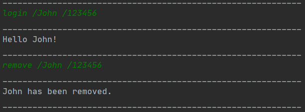

# User Guide

WhereGotTime is an application for the student to check their timetable and compare them against their peers for a common timeslot to be able so that they can schedule a study time together

* Table of Contents
{:toc}

## Quick Start

1. Ensure you have Java 11 or above installed in your Computer.
1. Down the latest version of  WhereGotTime.jar from [here](https://github.com/AY2021S1-CS2113-T13-3/tp/releases/tag/2.0).
1. Copy the jar file into an empty folder you want to use as the home folder for your WhereGotTime.
1. Open a command window in that folder
1. Run the command java -jar {filename}.jar e.g., java -jar Duke.jar (i.e., run the command in the same folder as the jar file)
1. Type the command in the command box and press Enter to execute it. e.g. typing bye and pressing Enter will close the app. 
Some example commands you can try:
    1. login /JohnSnow /123123: login as JohnSnow
    1. add /CS2113 Lec /mon /1600-1800 /LT23: Adds an event named CS2113 Lecture for current logged in the student (JohnSnow) to Time Table
    1. edit /mon  
       /1 /1300-1400 : Edits first event named CS2113 on Monday for current logged in (JohnSnow) in the TimeTable
    1. list /all: list of all the classes that JohnSnow has in a new line, enumerated.
    1. find /CS2113: finds all the classes that JohnSnow has containing "CS2113"
    1. delete /mon /1 : Deletes the 1st class shown in the current list.
    1. clear /mon: Deletes all classes in the current list for JohnSnow for his Monday timetable
    1. remove /JohnSnow /123123: Remove JohnSnow and all his timetable

## Features 
* Login user
* Remove user
* Add timetable
* Edit timetable
* List timetable
* Compare timetable
* Find class
* Delete timetable
* Clear timetable
* Help command
* Exit program

### Login user: `login`
Creates a new User with inputted username and password (if first time user).
Logs the existing user back into the app. (existing user)

Format: 

`login /username /password(6-digit)`

Example of usage: 

`login /John /123456`

Expected Output:

 

### Remove user: `remove`
Remove existing User and their timetable with inputted username and password.

Format: 

`remove /username /password(6-digit)`

Example of usage: 

`remove /John /123456`

Expected Output:

 

### Adding a timetable: `add`
Adds a new timetable to the list of timetable arraylist.

Format: 

`add /event name /day /timeStart-timeEnd /Location`
  
Example of usage: 

`add /CS2040C Tut /mon /0800-1000 /COM1-2`

`add /CG2028 Tut /Thu /1200-1300 /E4-4-1`

Expected Output:

 

### Editing a timetable : `edit`
Edits an existing timetable with a new timing.

Format: 

`edit /day`  

`/index /newStarttime-newEndtime`  

Note: You may get the `index` by listing the full timetables using `list /all`

Example of usage:

`edit /mon`  

`/1 /1100-1200` 

`edit /thu`   

`/1 /1300-1500`  

Expected Output:

 
### Listing a timetable: `list`
Lists all the classes on a particular day or on all days

Format: 

`list /day`

Example of usage:

`list /mon`

`list /all`

Expected Output:

 

### Comparing timetables: `compare`
Compares current User's timetable to Target user's timetable and returns a range of common available timeslots. 

Format:  

`compare` 
`TargetUser's index` 
`day` 
  
Example of usage:  

`compare` 
`1` 
`mon` 

`compare` 
`2` 
`tue` 

Expected output:  

 

### Finding a class: `find`
Lists all the classes based on the keyword entered by user

Format: 

`find /keyword`

Example of usage:

`find /CG2028`

`find /Tut`

Expected output:

 

### Deleting a class: `delete`
Deletes a class as specified by the user 

Format: 

`delete /day /index`

Example of usage:

`delete /thu /1`

Expected Output:

 

### Clearing timetable: `clear`
Clears all the classes on the day specified by the user

Format: 

`clear /day`

Example of usage:

`clear /thu`

`clear /all`

Expected Output:

 

### Help Command: `help`
Displays the list of commands available and their usage 

Format: 

`help`

Expected output:

 

### Exiting the program: `bye`
Exits the Program 

Format: 

`bye`

Expected output:

 

## Command Summary
* Login user 

    `login /username /password`
* Add timetable 

    `add /event name /day /timeStart-timeEnd /Location`
* Edit timetable
 
    `edit /day`  
    `/index /newStarttime-newEndtime`
* List timetable 
    
    `list /day`
* Compare timetable 
    
    `compare /target username /day`
* Find class 

    `find /keyword`
* Delete timetable 
    
    `delete /day /index`
* Clear timetable 
    
    `clear /day`
* Help Command 
    
    `help`
* Exit program 
    
    `bye`
