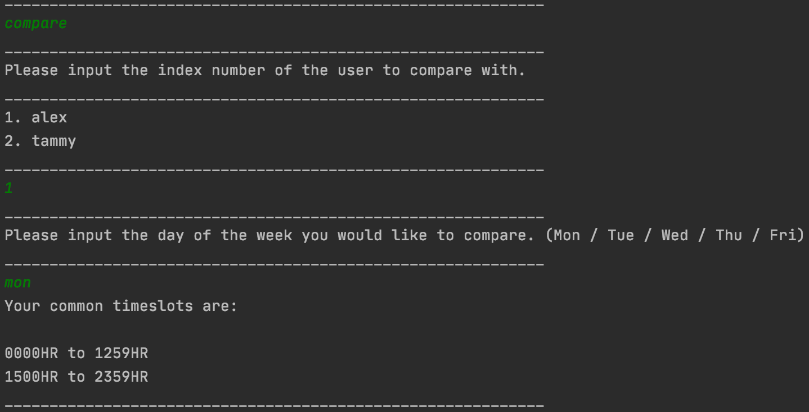
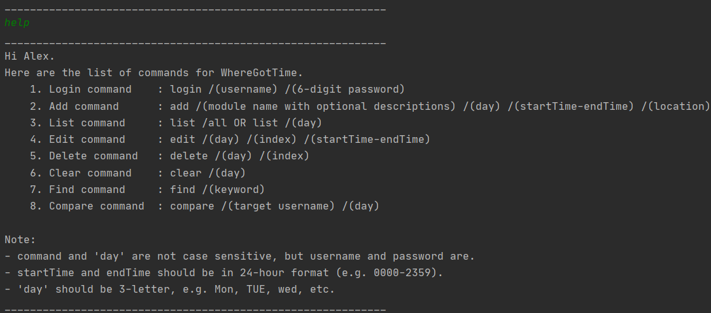

# User Guide

WhereGotTime is an application for the student to check their timetable and compare them against their peers for a common timeslot to be able so that they can schedule a study time together

* Table of Contents
{:toc}

## Quick Start

1. Ensure you have Java 11 or above installed in your Computer.
1. Down the latest version of  WhereGotTime.jar from [here](https://github.com/AY2021S1-CS2113-T13-3/tp/releases/tag/2.0).
1. Copy the jar file into an empty folder you want to use as the home folder for your WhereGotTime.
1. Open a command window in that folder
1. Run the command java -jar {filename}.jar e.g., java -jar Duke.jar (i.e., run the command in the same folder as the jar file)
1. Type the command in the command box and press Enter to execute it. e.g. typing bye and pressing Enter will close the app.<br/>
Some example commands you can try:
    1. login /John Snow /123123: login as John Snow
    1. add /CS2113 Lec /mon /1600-1800 /LT23: Adds an event named CS2113 Lecture for current logged in the student (John Snow) to Time Table
    1. edit /mon <br/>
       /1 /1300-1400 : Edits first event named CS2113 on Monday for current logged in (John Snow) in the TimeTable
    1. list /all: list of all the classes that John Snow has in a new line, enumerated.
    1. find /CS2113: finds all the classes that John Snow has containing "CS2113"
    1. delete /mon /1 : Deletes the 1st class shown in the current list.
    1. clear /mon: Deletes all classes in the current list for John Snow for his Monday timetable

## Features 
* Login user
* Add timetable
* Edit timetable
* List timetable
* Compare timetable
* Find class
* Delete timetable
* Clear timetable
* Help command
* Exit program

### Main menu
The launch screen of WhereGotTime includes Storage initialisation messages that indicates the status of loading from previous timetable via the text file

```
Data folder found! Finding WhereGotTime.txt...
Existing WhereGotTime.txt found. Loading previously saved timetable information...
Timetable information loaded successfully!
Storage initialisation completed without issue.
____________________________________________________________
 _    _ _                   _____       _ _____ _                
| |  | | |                 |  __ \     | |_   _(_)               
| |  | | |__   ___ _ __ ___| |  \/ ___ | |_| |  _ _ __ ___   ___ 
| |/\| | '_ \ / _ \ '__/ _ \ | __ / _ \| __| | | | '_ ` _ \ / _ \
\  /\  / | | |  __/ | |  __/ |_\ \ (_) | |_| | | | | | | | |  __/
 \/  \/|_| |_|\___|_|  \___|\____/\___/ \__\_/ |_|_| |_| |_|\___|
                                                                 
Hello! Welcome to WhereGotTime, a special timetable program that helps 
you and your friend find common unoccupied slots in the timetable!

You're currently not logged in.

Tip: enter 'help' for a list of commands.
____________________________________________________________
```

Note that the Storage initialisation message is dependent on your 


### Viewing help menu: `help`
Whenever you require assistance and want to see a list of valid commands and their input format, type `help` in the console and press <kbd>Enter</kbd>
Note: in `edit` and `compare`, on-screen prompt will guide you through the process, hence `help` is not valid in these two modes.

Expected outcome:
```
____________________________________________________________
You're currently not logged in.
Here are the list of commands for WhereGotTime.
	1. Login command	: login /(username) /(6-digit password)
	2. Add command		: add /(module name with optional descriptions) /(day) /(startTime-endTime) /(location)
	3. List command		: list /all OR list /(day)
	4. Edit command		: edit /(day)
	5. Delete command	: delete /(day) /(index)
	6. Clear command	: clear /(day)
	7. Find command		: find /(keyword)
	8. Compare command	: compare
	9. Bye command		: bye

Note:
- the brackets shown above should be omitted when entering commands
- if this is your first time using WhereGotTime, using the Login command would 
  create a new user profile that matches (username) and (6-digit password)
- command and 'day' are not case sensitive, but username and password are.
- startTime and endTime should be in 24-hour format and in 1-hour block. e.g. 0900, 1300, 2300, etc.
- 'day' should be 3-letter, e.g. Mon, TUE, wed, etc.
____________________________________________________________
```


### Login user: `login`
Creates a new User with inputted username and password (if first time user).
Logs the existing user back into the app. (existing user)

Format: 

`login /username /password(6-digit)`

Example of usage: 

`login /John /123456`

Expected Output:

<br/>

### Adding a timetable: `add`
Adds a new timetable to the list of timetable arraylist.

Format: 

`add /event name /day /timeStart-timeEnd /Location`
  
Example of usage: 

`add /CS2040C Tut /mon /0800-1000 /COM1-2`

`add /CG2028 Tut /Thu /1200-1300 /E4-4-1`

Expected Output:

<br/>

### Editing a timetable : `edit`
This command allows user to edit an existing timetable belonging to him or her.

Conditions:
- the user must first be logged in
- there should be a class in that day

Format:

`edit /day` <br/>

`/index /newStarttime-newEndtime` <br/>

Note: if you do not have a lesson on that day, the expected output

Example of usage:

`edit /mon` <br/>

`/1 /1100-1200`<br/>

`edit /thu` <br/> 

`/1 /1300-1500` <br/>

Expected Output:

<br/>


### Listing a timetable: `list`
Lists all the classes on a particular day or on all days

Format: 

`list /day`

Example of usage:

`list /mon`

`list /all`

Expected Output:

<br/>

<br/>

### Comparing timetables: `compare`
Compares current User's timetable to Target user's timetable and returns a range of common available timeslots.<br/>

Format: <br/>

`compare`<br/>
`TargetUser's index`<br/>
`day`<br/>
  
Example of usage: <br/>

`compare`<br/>
`1`<br/>
`mon`<br/>

`compare`<br/>
`2`<br/>
`tue`<br/>

Expected output: <br/>

<br/>

### Finding a class: `find`
Lists all the classes based on the keyword entered by user

Format: 

`find /keyword`

Example of usage:

`find /CG2028`

`find /Tut`

Expected output:

<br/>

### Deleting a class: `delete`
Deletes a class as specified by the user 

Format: 

`delete /day /index`

Example of usage:

`delete /thu /1`

Expected Output:

<br/>

### Clearing timetable: `clear`
Clears all the classes on the day specified by the user

Format: 

`clear /day`

Example of usage:

`clear /mon`

Expected Output:

<br/>

### Help Command: `help`
Display the list of commands available and their usage<br/>

Format: 

`help`

Expected output:

<br/>

### Exiting the program: `bye`
Exits the Program<br/>

Format: 

`bye`

Expected output:

<br/>

## Command Summary
* Login user 

    `login /username /password`
* Add timetable 

    `add /event name /day /timeStart-timeEnd /Location`
* Edit timetable
 
    `edit /day` <br/>
    `/index /newStarttime-newEndtime`
* List timetable 
    
    `list /day`
* Compare timetable 
    
    `compare /target username /day`
* Find class 

    `find /keyword`
* Delete timetable 
    
    `delete /day /index`
* Clear timetable 
    
    `clear /day`
* Help Command 
    
    `help`
* Exit program 
    
    `bye`
